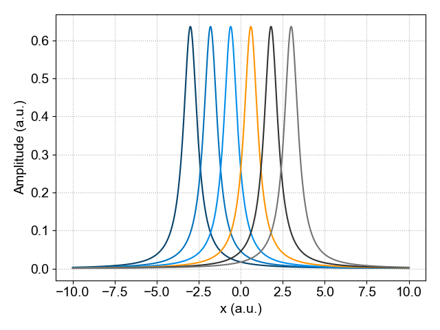

========
Indexing
========

In this section we will give a short overview how to index a SpinLab data object.

Generate an Example Data Set
============================
First, we start by generating an example data set. To do this, we will first Use the built-in function ``math.lineshape.lorentzian`` to generate a 2D data set of Lorentzian distributions followed by creating the SpinLab data object using the function ``sl.SpinData``.

.. code-block:: python

    >>> import numpy as np
    >>> import spinlab as sl
    
    >>> x = np.linspace(-10,10,1024)
    >>> y = np.linspace(-3,3,6)

    >>> values = sl.math.lineshape.lorentzian(x.reshape(-1, 1), y.reshape(1, -1), 0.5)

Next, create the SpinLab data object

.. code-block:: python

    >>> data = data = sl.SpinData(values, ["x", "x0"], [x, y])

For this example the two dimensions are labeled **x** and **x0**.

The ``SpinData`` object can be easily ploted using the built-in plotting function:

.. code-block:: python

    >>> sl.plt.figure()
    >>> sl.plot(data)
    >>> sl.plt.grid(ls = ":")
    >>> sl.plt.ylabel("Amplitude (a.u.)")
    >>> sl.plt.tight_layout()
    >>> sl.plt.show()

    Plot of the two-dimensional SpinLab data object.

Indexing a SpinLab Data object
==============================
A SpinLab data object has typically 4 different attributes:

    1. **values** (Numpy array): Numpy Array containing data
    2. **coords** (Python list): List of numpy arrays containing axes of data
    3. **dims** (Python list): List of axes labels for data
    4. **attrs** (Python dictionary): Dictionary of parameters for data

The content of the sldata object can be easily viewed using the Pyhton ``print`` function:

.. code-block:: python

    >>> print(data)

    values:
            1024 x 6 ndarray (float64)
    dims:
            ['x', 'x0']
    coords:
            array([-10.        ,  -9.98044966,  -9.96089932, ...,   9.96089932,
            9.98044966,  10.        ], shape=(1024,))
            array([-3. , -1.8, -0.6,  0.6,  1.8,  3. ])
    attrs:

Indexing using Integers
-----------------------
Let's start with the simplest way to extract (index) a single spectrum from a 2D data set. The data set that was created earlier has two dimensions: One dimension contains the Lorentz distribution (``dim = 'x'``) and the other dimension referes to different locations (``dim = 'x0'``).

The user has to specify the name of the dimension from which a slice has to be extraced. This index has to be an integer and follows the Python convention for indexing (0 is the first index, -1 is the last index).

To index a sldata object, specify the name of the dimension and the index of the slice. To specify a slice based on the index, an **integer** is used. For example, to select the slice with index 3 use:

.. code-block:: python

    >>> data_slice_integer = data["x0", 3]
    >>> data_slice_integer.squeeze()

This will select the a slice 3, and a new sldata object is created. However, taking the slice does not remove the ``x0`` dimension. We can remove dimensions of length 1 with the ``squeeze()`` method to remove the ``x0`` dimension.

It is also possible to select a subset of the original data by specifying a range of values. To do this, we use a tuple specify the minimum and maximum values for the index. For example:

.. code-block:: python

    >>> data_slice_range = data["x0", (-3, 3)]

The last slice can extraced by using:

.. code-block:: python

    >>> last_slice = data["x0", -1]

Indexing using Float
--------------------
In the previous example, a single slice or a sub-set of spectra was selected using an integer number to index the data set. This is convenient if this dimension has only a small number of indexes. However, when this dimension is large it is less convenient to use an integer and a specific region can be extracted using a float. In this case, the nearest float will be picked.

To do this, we use a float to specify the location. In Python, by adding a period after the number, the number is interpreted as a float instead of integer (for example 3. or 3.0 indictate a float).

To extract a slice at a specific value of the x axis use:

.. code-block:: python

    >>> data_slice_float = data["x", 0.5]
    >>> data_slice_float.squeeze()

As in the previous example, we can remove the ``x0`` dimension using the ``squeeze()`` method.

Indexing Multiple Dimensions
----------------------------
#For multi-dimensional data sets, the user can specify multiple dimensions at once. For example ``data['x', 1:10, 'y', :, 'z', (3.5, 7.5)]``.